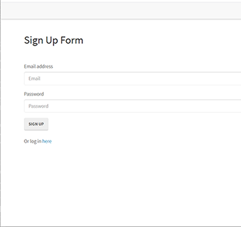
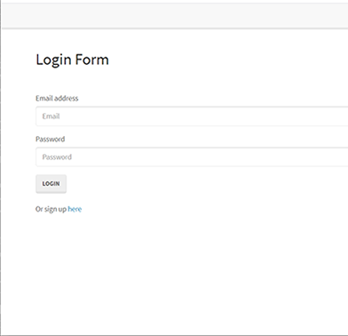
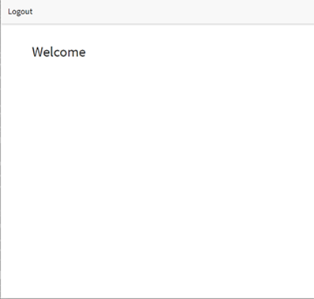

# Member Signup and Authentication Stack (Reverse Engineered)

This is a full stack of front-end and back-end code files needed to create a members-only section or "walled garden" on the web, with a member sign-up, log-in and authentication process, and a members-only page that can be accessed by signing in.

## Contents | Quick Links
[Getting Started](#start)     |     [Instructions](#instruct)     |     [Demo](#demo)     |     [Built With](#built)     |     [Author](#author)     |     [Visuals](#visuals)     |     [Contributing & Tests](Contributing.md)     |     [Contact](#contact)

## [Getting Started](#start)

### Download the app from Git Hub here:
* [Repo URL](https://github.com/jenjayme/reverse-engineering/)

### Contents: 
You'll find code files in the folders as follows - all are discussed in further detail in the accompanying [Codebase Walk-Thru](https://docs.google.com/document/d/1n8hUl6anVpC5m00Ur7OSvRvjdlVCfPpqq4iuVsIY-nc/edit?usp=sharing): 
* **public folder** contains three interconnected front-end html pages that demonstrate the user-side functionality - a sign-up page, log-in page, and a welcome page which can only be reached upon successful authentication.  The stylesheets subfolder contains the style.css file which influences the look of the front-end pages, and the js folder contains the script files that transform form inputs into api requests and send those requests when a submit button is clicked.    
* **config folder** contains some interconnected back-end files designed to authenticate users and store their information securely.  The config.json file  establishes a connection to the MySql database, Passport encrypts user login and password information for secure storage, and the "Middleware" acts as a gatekeeper to restricts the routes a user can visit if not logged in, and allow authenticated users to enter the "walled garden."
* **models folder** contains script files that start the engine of the program.  The index.js initiates Sequelize, and establishes connection to the "User" model.  The User model defines all of the fields and functions associated with a User, which is the basic unit around which the login process revolves.
* **node_modules folder** contains the various helper programs and resources needed to operate each step of the sign-up, log-in and authentication process, including ExpressJS, Bcrypt, and MySql2.  
* **routes folder** contains two important files that control the get and post requests made to the database and the navigation that happens in conjunction with the response.  If a user is found and authenticated, they are directed to the welcome page. If not, they are directed to the sign-up page. The api-routes file contains the sign-up, log-in and log-out functions, and the html-routes contain the functions on the /members route.
* **outside the folders** The **server.js** file could be considered the spine of the program - it sets up the server port to listen for requests and establishes connections to the database, models, and api routes.  Finally, the **package.json** summarizes the key information about the app including main script and the modules upon which it depends.

### You can view a demo here: 
* [Deployed URL](https://jenjayme.github.io/reverse-engineering/#demo)

## [Visuals](#visuals)

## [Built With](#built)
* HTML5
* Javascript
* VS Code
* NPM
* Node.js
* Express.js
* MySql2
* Sequelize
* Bcrypt
* Passport

## [Author](#author)
Readme by:

Jen Jayme

Developer

Novato, CA

[/JenJayme](https://www.linkedin.com/in/jenjayme)

## [Questions](#contact)
For questions or to discuss collaborations on this or other projects, contact me at:jeniferjayme@gmail.com

## Acknowledgements
Credit goes to Trilogy and Berkeley Boot Camp for developing the files included in this app.